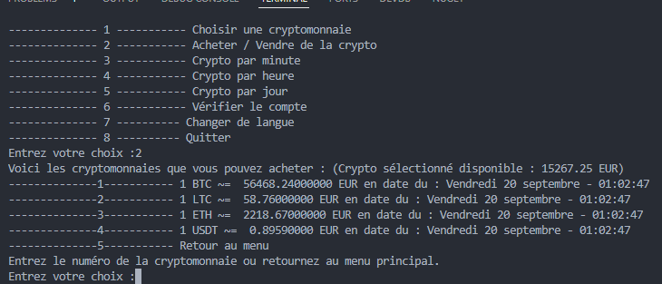

# SimulationCoin

Programme console qui utilise une API pour obtenir les taux de change des cryptomonnaies (comme Bitcoin, Ethereum, etc.). Le programme simulera des opérations d'achat et de vente automatiques selon les fluctuations des prix.

Suivi du projet sur [Notion](https://elated-rib-ed4.notion.site/Python-App-Crypto-5eca7be8044640c5b3ff04f4cd421709)

## Pré-requis

Ceci est pour informer l'utilisateur des conditions nécessaires avant l'utilisation de ce programme.

### Installation de python

#### Windows

1. **Télécharger l'installateur :**
   * Va sur le site officiel de Python à l'adresse [python.org](https://www.python.org/downloads/release/python-3126/).
   * Sélectionne l'option "Windows installer (64-bit)" pour télécharger l'installateur.
2. **Exécution de l'installateur :**
   * Lance l'exécutable que tu viens de télécharger.
   * Assure-toi de cocher la case "Add Python 3.12 to PATH" avant de cliquer sur "Install Now".
3. **Vérifier l'installation :**
   * Ouvre le Command Prompt (cmd) et tape `python --version`. Tu devrais voir `Python 3.12.6`.

#### macOS

1. **Télécharger l'installateur :**

   * Visite [python.org](https://www.python.org/downloads/release/python-3126/) pour obtenir la dernière version.
   * Clique sur "macOS 64-bit universal2 installer" pour le télécharger.
2. **Installer Python :**

   * Ouvre le fichier `.pkg` téléchargé et suis les instructions à l'écran pour installer Python.

   1. **Vérifier l'installation :**

      * Ouvre le Terminal et tape `python3 --version`. Tu devrais voir `Python 3.12.6`.

#### Linux

Pour Linux, l'installation peut varier selon la distribution, mais en général, tu peux utiliser `pyenv` pour installer plusieurs versions de Python. Voici les commandes générales :

```bash
# Installe pyenv
curl https://pyenv.run | bash

# Ajoute pyenv à ton shell
echo 'export PATH="$HOME/.pyenv/bin:$PATH"' >> ~/.bashrc
echo 'eval "$(pyenv init --path)"' >> ~/.bashrc
echo 'eval "$(pyenv virtualenv-init -)"' >> ~/.bashrc
source ~/.bashrc

# Installe Python 3.12.6
pyenv install 3.12.6
pyenv global 3.12.6

# Vérifie que la bonne version de Python est utilisée
python --version

```

### Installation de Pip

`pip` est généralement installé automatiquement avec Python à partir de la version 3.4 pour Windows et macOS. Pour Linux, il peut parfois être nécessaire de l'installer séparément. Voici comment tu peux installer ou mettre à jour `pip` sur différents systèmes d'exploitation :

#### Windows

Si `pip` n'est pas déjà installé avec Python, ou si tu veux simplement t'assurer qu'il est à jour, ouvre le Command Prompt et tape :

`python -m ensurepip --upgrade`

#### macOS

Sur macOS, tu peux installer ou mettre à jour `pip` en utilisant la commande suivante dans le Terminal :

`python -m ensurepip --upgrade`

#### Linux

Sur Linux, l'installation de `pip` peut se faire via le gestionnaire de paquets de ta distribution ou directement via `ensurepip` si tu utilises `pyenv` ou une installation manuelle de Python. Voici comment faire selon la méthode :

**Avec le gestionnaire de paquets (par exemple, pour Debian/Ubuntu) :**

```
sudo apt update
sudo apt install python3-pip
```

Utiliser `ensurepip` avec une installation manuelle :

```
sudo apt update
sudo apt install python3-pip
```

**Vérifier l'installation**

Pour vérifier que `pip` est correctement installé et voir quelle version tu as installée, utilise cette commande :

```
pip --version
```

ou

```
pip3 --version
```

Utilise `pip3` si ton système distingue Python 2 de Python 3 avec des commandes distinctes (`python` vs `python3`).

### Installation des libairies

#### Vérifier et installer `requests`

1. **Ouvrir le terminal ou le Command Prompt.**
2. **Vérifier si `requests` est déjà installé :**

   ```
   pip show requests
   ```

   Si cette commande retourne des informations sur le paquet, cela signifie que `requests` est déjà installé. Si non, tu peux passer à l'étape suivante pour l'installer.

#### Installer `requests`

1. ```
   pip install requests
   ```

## Configuration de l'application

A venir ...

## Lancement de l'application

La commande pour lancer l'application est `py main.py` à la racine.

## Aperçu de l'application


